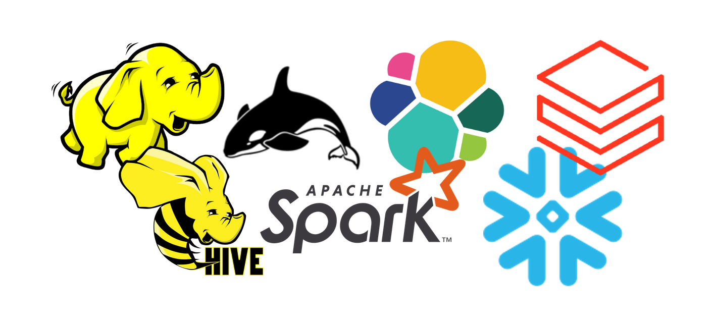
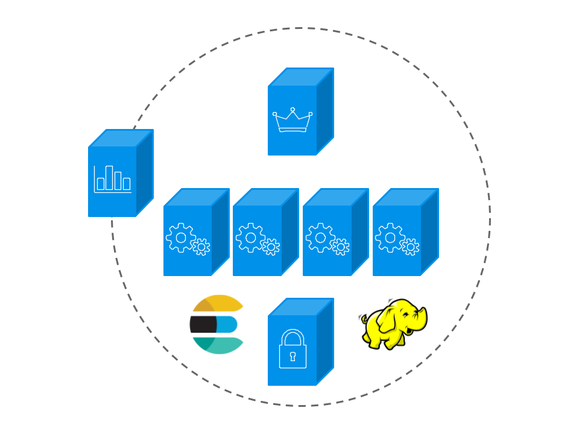
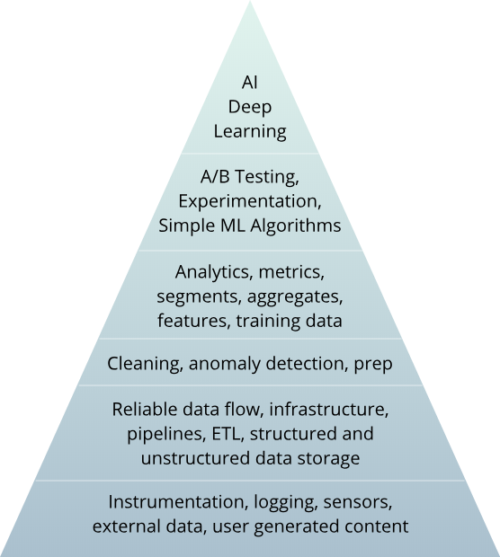

# Introduction to Big Data

Data, and the insight it offers, is essential for business to innovate and differentiate. Coming from a variety of sources, from inside the firewall out to the edge, the growth of data in terms of volume, variety and speed leads to innovative approaches. Today, Data Lakes allow organizations to accumulate huge reservoirs of information for future analysis. At the same time, the Cloud provides easy access to technologies to those who do not have the necessary infrastructure and Artificial Intelligence promises to proactively simplify management.

With Big Data technologies, Business Intelligence is entering a new era. Hadoop and the likes, NoSQL databases, and Cloud managed infrastrutures store and represent structured and unstructured data and time series such as logs and sensors. From collect to visualization, the whole processing chain is processed in batch and real time.



## Basic knowledge: Information Systems

What is an Information System (IS)?

- Collect data
- Process it
- Store it
- Distribute it

## Basic knowledge: Distributed systems

A distributed system is a group of computers that appear as a unique and coherent system to the end user.

## Basic knowledge: Horizontal vs vertical scaling

- **Vertical scaling:** increase the size of the servers = more RAM, more powerful CPUs, more disk space, etc.
- **Horizontal scaling:** increase the number of server instead of their size. Works for distributed systems.

## Basic knowledge: Data structure

- **Structured:** RDBMS tables, Excel sheet

- **Semi-structured:** JSON, XML, CSV

  ```sh
  # CSV
  firstname,lastname,birthdate,address
  Gauthier,Leonard,20220930,Blabla
  ```

  ```json
  // JSON
  [
    {
      "firstname": "Gauthier",
      "lastname": "Leonard",
      "birthdate": 20220930
    },
    {
      "firstname": "Toto",
      "lastname": null,
      "birthdate": "20220803"
    }
  ]
  ```

- **Unstructured:** plain text, images, sound

## History of data

**70's - 00's: RDBMS**

- Data created and used only by technical people (through programming languages)
- Non human readable
- Strongly typed => structured data

**2000-2005: Internet rises**

- Access to data
- Readable data => semi-structured data (HTML), unstructured data (text, images, sound)
- Beginning of NoSQL

**2005-today: Social networks**, customer 360

- Data explosion
- Data created and used by everyone
- End of Moore law

## Distributed systems

Advantages:

- Scalability
- Availability
- Flexibility

Disadvantages:

- Harder to architecture
- Harder to use
- Harder to maintain

## Big Data: The 3 Vs

- Volume
- Velocity
- Variety
- ... and friends

## Big Data: The 3 Vs - Volume

- It doesn’t fit in a RDBMS (TB, PB)
- It cannot be processed by one machine
- E.g. 1 day at Facebook:
  - 3 billions + content elements
  - 4 PB + of new data

## Big Data: The 3 Vs - Velocity

- To save and process all the all data generated
  - E.g. Google processes 100 million pages per day
- To deliver near real time results
  - E.g. Google search results < 1 sec, Facebook Messenger

## Big Data: The 3 Vs - Variety

- All types of data
- 20% structured or semi-structured, 80% unstructured

## Who needs Big Data?

- Not only GAFAM
- For "normal" enterprises (where data is not at the core of the business)
  - Extract value from their data
  - Build "Data Lakes": gather data from all around the company (+ outside)

## Big Data clusters

- **Cluster:** Group of connected computers that can be viewed as a single system
- Master-slave (workers) model
- Examples of "Big Data stacks":
  - Apache Hadoop
  - Elasticsearch
  - Apache Cassandra



## The Hadoop Ecosystem

- Characteristics

  - Created in 2006 at Yahoo
  - Open-source ([Apache Software Foundation](https://github.com/apache))
  - Java
  - Linux

- Stack
  - **Distributed Filesystem:** HDFS (Hadoop DFS)
  - **Cluster Manager:** YARN (Yet Another Resource Negotiator)
  - **Execution Engines:** MapReduce, Tez, Spark
  - **Warehouse/SQL:** Hive
  - **NoSQL DB:** HBase
  - And other stuff

## Data jobs: Data Analyst

- Business intelligence
- Data Mining
- Visualization, graphs
- SQL / BI Tools

## Data jobs: Data Scientist

- Machine Learning / Deep Learning
- Feature engineering - Visualization
- Python / R

## Data jobs: the Data Science hierarchy of needs

- Learn, optmize
- Aggregate, label
- Explore, transform
- Move, store
- Collect



## Data jobs: Data Engineer

Data Engineers are in charge of building the infrastructure to deliver, store and process the data. They collect, move, store and prepare the data.

- Data ingestion and storage
- Data pipelines and orchestration - Optimization
- Hive / Spark / DFS

## Data jobs: Data Architect

- Data Lake (or data platform) architecture
- Components installation and monitoring
- Ensure the data is securely accessed and governed
- Knowledge of all available Big Data tools and when to use them

## Data jobs: Data Something...

- Data Steward
- Chief Data Officer
- ML Engineer

## Resources

- [Data Engineering](https://www.adaltas.com/en/skills/data-engineering/)
- [Data Science](https://www.adaltas.com/en/skills/data-science/)
- [How to become a Data Engineer](https://khashtamov.com/en/how-to-become-a-data-engineer/) (jan 2020)
