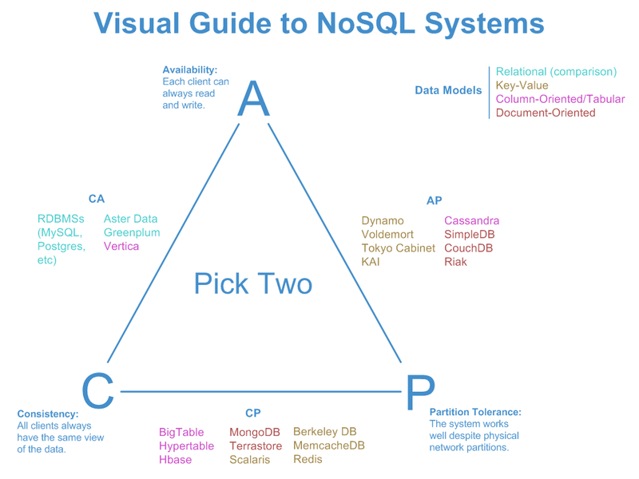
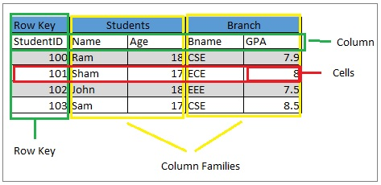
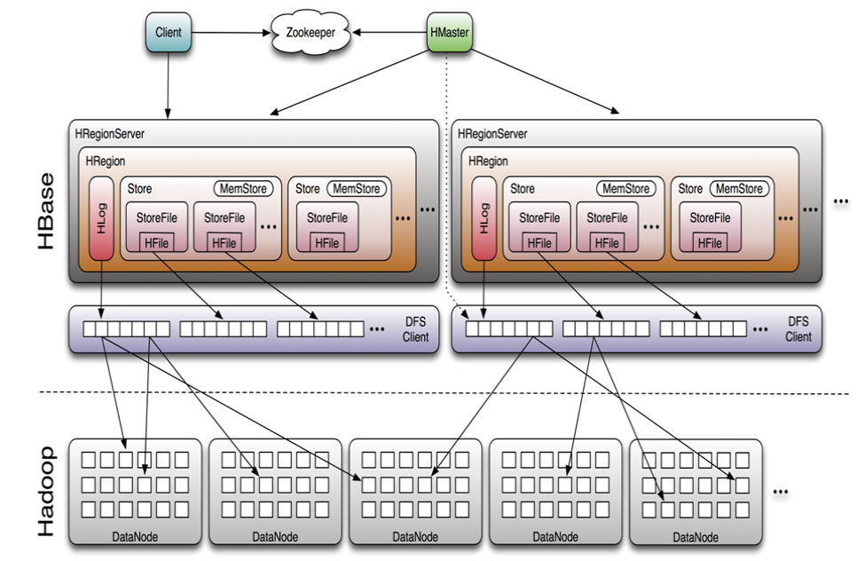

# NoSQL with HBase

## What is NoSQL?

- **Key-value**:
  - 1 key = 1 value
  - Examples : Redis, Memcache (in memory)
- **Wide-column**:
  - each column or column family is stored separately
  - Examples : Apache HBase, Apache Cassandra (ScyllaDB)
- **Document stores**:
  - JSON/XML like objects
  - Examples : MongoDB, CouchDB
- **Graph**:
  - Store nodes and relationships (edges) between them
  - Examples : Neo4j, JanusGraph

## Apache HBase

- _Apache HBase™ is the Hadoop database, a distributed, scalable, big data store_ - [hbase.apache.org](hbase.apache.org)
- Random, realtime read/write access to Big Data
- Inspired from Google BigTable paper (2006)
- Stores data in HDFS

## The CAP Theorem

- **Consistency**: For one given query, all the nodes return the most recent value or an error
- **Availability**: Every query receives a fast response, without guarantee that this is the latest value
- **Partition tolerance**: The system continues to work even if some nodes are disconnected
- No storage system can ensure more than 2 of those properties at the same time



## Apache HBase

- HBase is a **CP columnar** database
- AP equivalent = [Apache Cassandra](https://cassandra.apache.org)

## HBase: Data structure

- A table is a collection of rows
- A row has several **column families** defined at table creation
- A column family has **any number of columns**
- 1 row =
  ```python
  {
    key: {
      column_family_1: { col_1: a, col_2: b},
      column_family_2: { col_3: c, col_4: d}
    }
  }
  ```



## HBase: Data storage

- Data is stored:
  - In HDFS in the **HFiles**
  - In RAM in the **Memstore**
- Tables are split into **regions**
  - 1 region = all rows in a certain **range of keys**
  - The number of regions depends on the size of the table



## HBase: Components

- **HBase Master**
  - Handle table creation/deletion queries
  - **Assigns regions** to RegionServers and monitor them
- **RegionServer**
  - 1 region of a table is managed by 1 RegionServer

## HBase: Data storage in RegionServers

1. On data write:
   - Storing in the **Memstore in RAM**
   - Storing in the **HLog in HDFS** (Write Ahead Log)
2. When the Memstore or the HLog reaches max size: flush to **HFile in HDFS** (1 per CF). Temporary **compactions**.
3. If the RegionServer crashes, operations are replayed from the HLog for the Memstore and metadata loaded from the HFile (by another RegionServer).

## HBase: Partition tolerance and HA

- RegionServers tracked by ZooKeeper
  - On crash, HMaster knows it through ZooKeeper
  - HMaster re-assigns regions to other RegionServers
- High Availability: multiple HBase Masters

## Querying HBase

- HBase client
  - CLI
  - Languages / tools (e.g. NiFi)
- Apache Phoenix, SQL on HBase (in memory)
- Apache Hive
