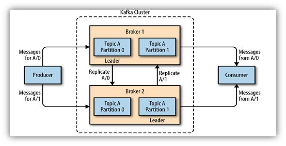
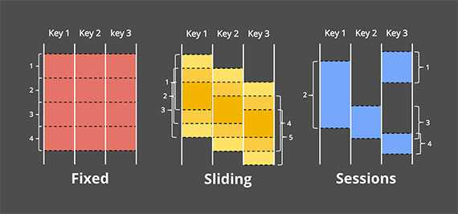
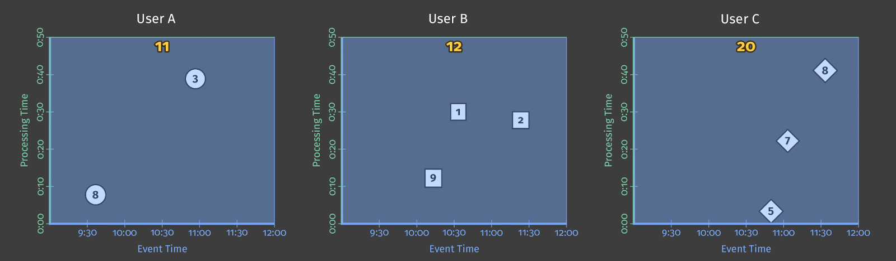
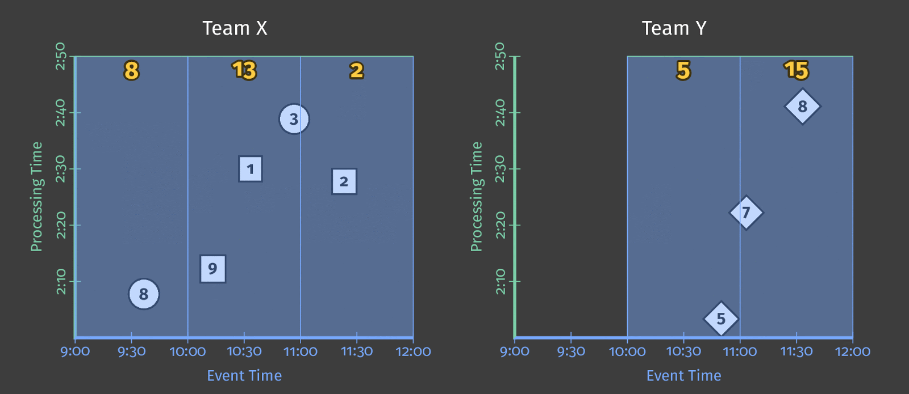
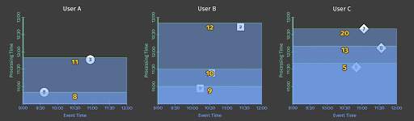

# Stream processing

## What is Streaming?

1. **Unbounded data sets** (in opposition to finite data sets);
2. **Unbounded data processing** (in time);
3. **Low-latency**, approximate and/or speculative results.

## Streaming tools

- Distributed **messaging systems**:
  - Publish/consume messages to/from queues
  - Fault-tolerant
- Distributed **stream processing engines**:
  - Exactly-once, fault-tolerant processing
  - Aggregations, event-time windows

## Apache Kafka: Functionalities

A **distributed streaming platform**. From [Kafka web site](https://kafka.apache.org/):

- **Publish and subscribe to streams of records**, similar to a message queue or enterprise messaging system.
- **Store streams of records** in a fault-tolerant durable way.
- **Process streams of records** as they occur (new).

## Kafka: The Messaging System

Records are published to **topics**.

- 1 record = (key, value, timestamp)
- 1 record belongs to 1 topic

## Kafka: Topics

- 1 topic is split into **1 to N partitions**
- Each topic is **replicated** 1 to M times
- Records **order is guaranteed** within a partition
- Records are persisted given a **retention period**

## Kafka: Producers

Kafka is **dumb** (no routing policy) = **producers** are responsible for
choosing **which topic and which partition** to write to

Methods to choose: round-robin, based on key, etc.

## Kafka: Consumers

- Choose the offset to start reading
- Each record delivered to 1 consumer of each consumer group (1 partition to 1 consumer)
- Fair distribution of records between consumers of a group → scalability + fault tolerance

## Kafka: Data distribution

Server = Kafka **broker**

For each partition:

- 1 “leader” → read + write requests
- 0 to N-1 “followers” → replication

## Apache Kafka performance

- The performance is **not impacted by the volume** stored
- Allow **scale of processing** → increase consumer instances
- Keep **records order** → 1 consumer receives records from 1 partition
- **Multiple independent “customers”** → 1 offset per consumer

## Other use cases

- **Storage system** (especially for logs):
  - Data written to disk + replicated (CP)
  - No performance impact from ↗ volume
- **Stream processing**: New API **Kafka Streams**

## Stream processing problematic

- **Event time** vs **processing time**

**Windows:**

- Needed for aggregations
- Processing or event time?

- **Watermark** = given an event time E to a processing time P, we state that _at time P, all data generated prior to E have been observed_

- **Trigger** = time when the output are materialized

## Stream processing: Dataflow model

[Dataflow model](http://www.vldb.org/pvldb/vol8/p1792-Akidau.pdf): define the pipeline with 4 questions:

1. **What** results are calculated?
2. **Where** in event time are result calculated?
3. **When** in processing time are results materialized?
4. **How** do refinements of results relate?

Let's look at the examples for each of them.

1. **What** results are calculated? → **Aggregation**

Eg. sum by key

2. **When** in event time are results are calculated? → **Windows**

Eg. fixed window of 1 hour

3. a. **When** in processing time are results materialized? → **Triggers**

Eg. every 10 min in processing time if new element(s)

3. b. **Triggers =** watermark, processing time, count...

Eg. every 10 min in processing time if new element(s)

4. **How** do refinements of results relate?

Multiple results for a window:

- Discarding = send each result separately
- Accumulating = send the aggregated result every time
- Both = send aggregate result + retraction message

## Stream processing engines

- Main solutions: Apache **Flink**, Apache **Spark**, Apache Storm, Apache Kafka Streams, Google Dataflow, Apache Samza
- Quick comparison: …?
- Streaming vs micro-batching

## Data flows: isn’t that streaming?

- Manage flow of information between systems
  - Routing/Filtering
  - Parsing
  - Transforming
- Not targeting latency but throughput + delivery guaranties

## Apache NiFi

- FlowFile:
  - Content
  - Attributes
  - Provenance
- Processors
- Back pressure mechanism
