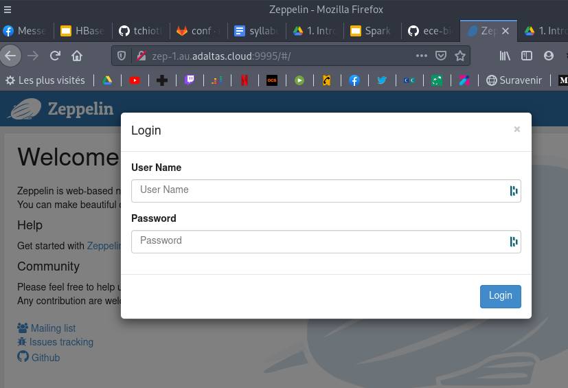

# Data Engineering with Spark

## Lab 1: Unstructured data analysis with RDDs

Analyze unstructured data (text) with RDDs and Spark Core Functions.

### Prerequisites

Connect to the Adaltas cloud cluster using OpenVPN.

### Goals

- Get familiar with the most frequently used functions for RDD processing: `map`, `flatMap`, `reduceByKey`
- Learn how to define lambda functions
- Learn when you can use pure Python functionalities and constructs in Spark environment  

### Connection to Zeppelin

1. Navigate to http://zep-1.au.adaltas.cloud:9995 with your browser
2. Login using your Adaltas cloud credentials
   
3. In the folder `ece-2022-spring/spark/ref`:
   1. Navigate to the `lab1` notebook
   2. Create a copy of the notebook (by using the **Clone this note** button) and name it like follow: `ece-2022-spring/spark/cluster-username/lab1` (e.g. `ece-2022-spring/spark/gauthier/lab1`). This should create your folder in `ece-2022-spring/spark`.
   3. In your notebook `lab1` → **🔒 Note permissions**: add the user `gauthier` to the “Runners” (and any other user you want)
   4. Initialize your interpreter by running the first cell

### During the session

Go through the notebook and fill the blanks. By the end of the session we should have:

- The number of words by chapter
- The number of occurrence of each word in each chapter

### Homework

You have to:

1. Count the total number of words in the whole book
2. Find the top 10 of the most used words
   1. By chapter
   2. In the whole book
3. Find the most used word at the start of a paragraph
4. Bonus: print the results nicely

### Resources

Spark docs:

- [Pyspark API reference doc](https://spark.apache.org/docs/latest/api/python/pyspark.html)
- [RDD Transformations](https://spark.apache.org/docs/latest/rdd-programming-guide.html#transformations)
