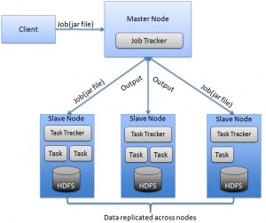
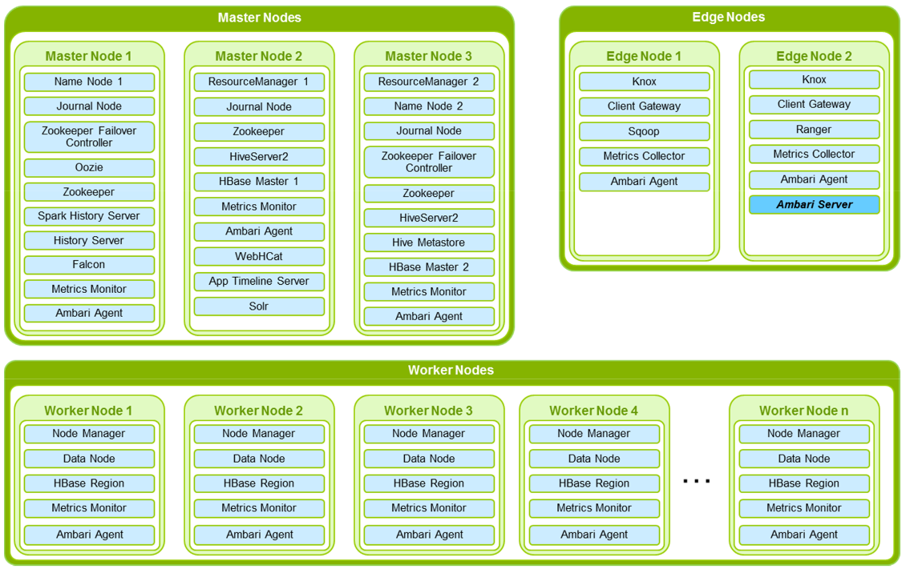
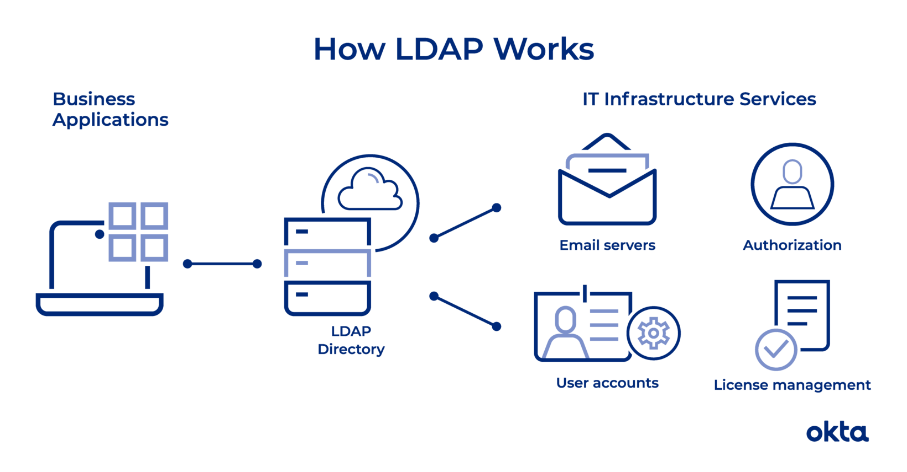
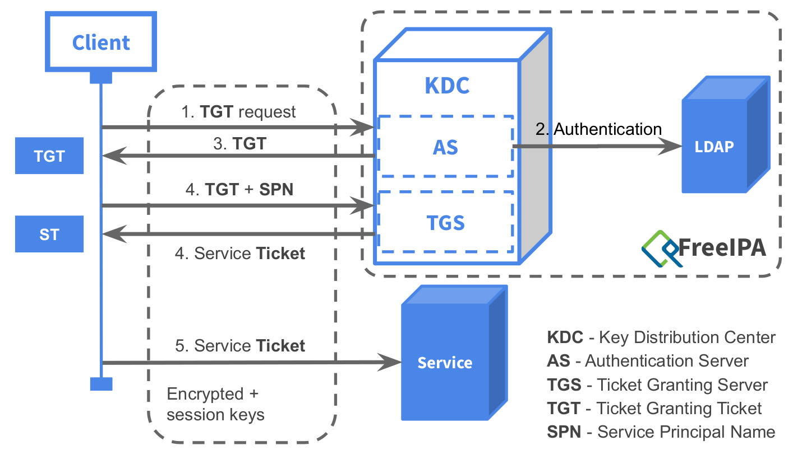

# Architecture and security

## Hadoop cluster topology

Hadoop high-level architecture

Node types:

- **Masters**: NN, RM, HBaseMaster
- **Utility**: HiveMetastore, Oozie, Ambari
- **Workers**: DN, NM, RS
- **Edge nodes**: HS2, Zeppelin, clients (hdfs, yarn, beeline, hbase, spark)
- **Security nodes**

Node hardware specifications:

- **Masters**: medium RAM/CPU, **RAID** on disks
- **Utility**: medium RAM/CPU
- **Workers**: lot of RAM/CPU, lots of disks (> 10), no RAID
- **Edge nodes**: can be VMs/containers
- **Security nodes**

## Security

3 main principles:

- **Identification**: indicate user’s identity
- **Authentication**: prove the user’s identity (e.g. password)
- **Authorization**: check user’s access rights to resources
- **+ Privacy** = Encryption

## Security: locally

Unix permissions (in Linux, MacOS):

- **UID + GID** (User ID, Group ID)
- Identification only
- **Security holes**: possible to impersonate a user by matching
the UID/GUID → e.g. HDFS client running in a container

## Identification: LDAP

LDAP = Lightweight Directory Access Protocol

- Stores **users** and **groups**
- Allows **identification** (“this user exists and belongs to those groups”)
- Also stores passwords for basic authentication
- Examples: OpenLDAP, FreeIPA, Active Directory (Microsoft)

## Authentication: Kerberos

- Authentication based on a **ticketing system**
- Single Sign-On (SSO)
- Mutual authentication (client-service)
- **Control access to services** by authenticating the users

- **Realm**: Administrative domain handled by a Kerberos server.
  - E.g. `AU.ADALTAS.CLOUD`
- **Principal**: Kerberos name associated to a user/service
  - E.g. `gauthier@AU.ADALTAS.CLOUD`, `hive/hs1.adaltas.cloud@AU.ADALTAS.CLOUD`
- **Ticket**: Token proving the user’s identity or the user’s right to
access a service

For more information, read [here](https://en.wikipedia.org/wiki/Kerberos_(protocol)#Protocol).

## Authorization: Apache Ranger

RBAC (Role Based Access Control) on Hadoop:

- HDFS (*rwx* on folders)
- YARN (access to queues)
- Hive (access to tables, columns)
- HBase (access to tables, column families, columns)

Integration with LDAP

## Privacy: Encryption in Hadoop

- Possible usage of SSL (like HTTPS) for services and client-service communications
- Wire encryption
- Encryption at rest
- Performance impact

## Centralized gateway: Apache Knox

- Avoid using Kerberos to connect to web UIs (SPNEGO)
- Expose all services on a single endpoint

## Governance

- Data catalog
- Audit logs (who accessed what data)
- Data lineage (application: GDPR)
- **Apache Atlas**:
  - Allows adding tags to data, tag propagation
  - Integration with Ranger to apply permissions
